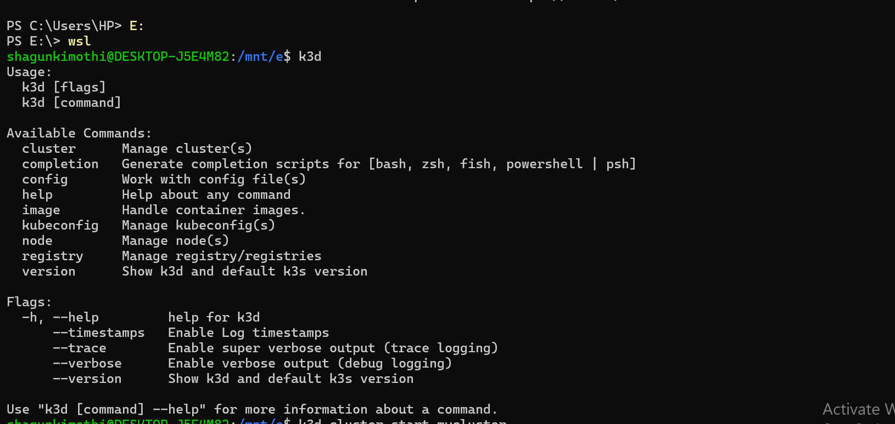
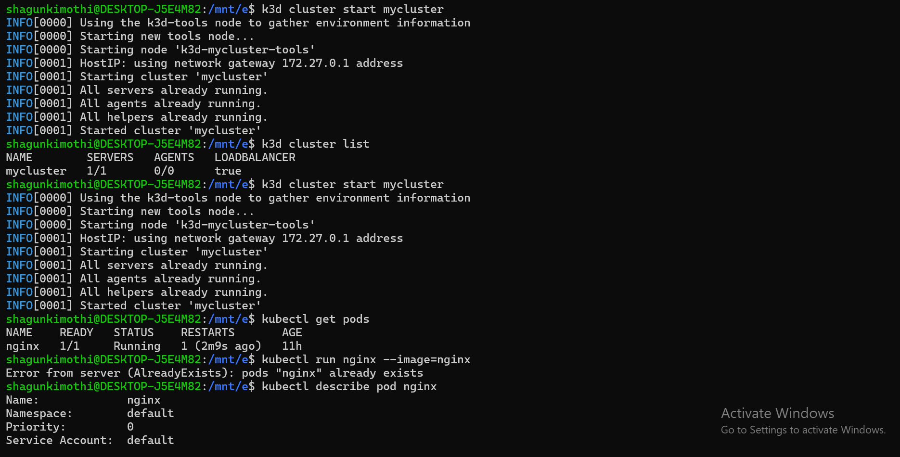
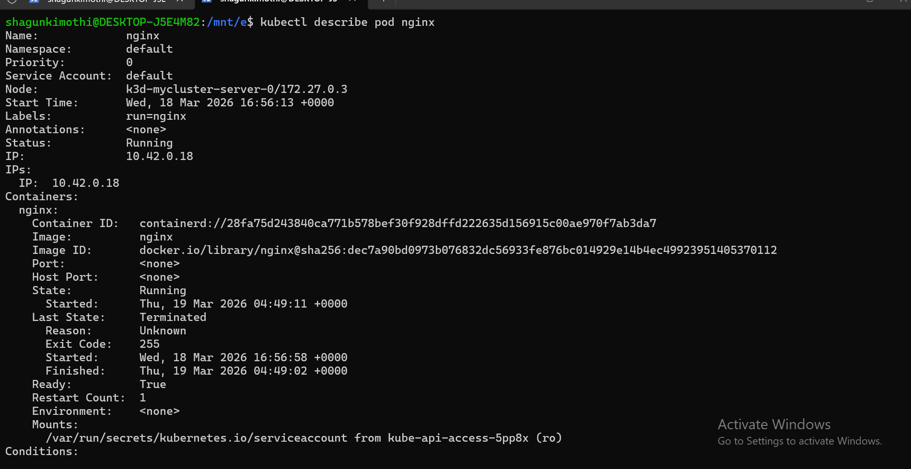
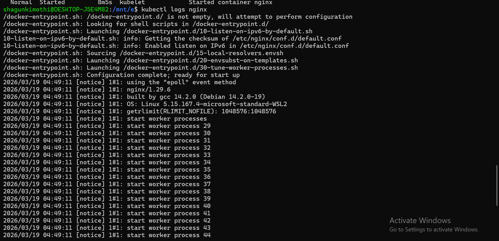
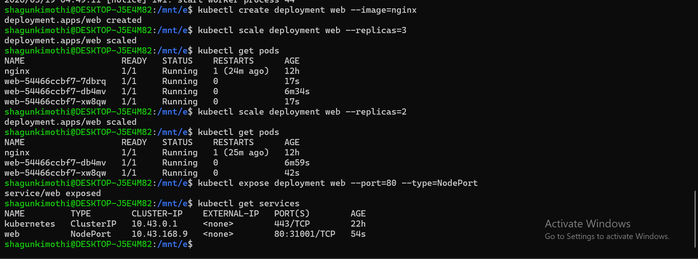

# 🐳 Kubernetes Hands-On Lab — 19 March 2026

A practical walkthrough of core Kubernetes concepts using **k3d** (k3s in Docker) on WSL2.  
Cluster: `k3d-mycluster` · Image: `nginx` · Tool: `kubectl`

---

## 📋 Table of Contents

- [Step 1 — Verify k3d & Start Cluster](#step-1--verify-k3d--start-cluster)
- [Step 2 — Run a Pod & Check Status](#step-2--run-a-pod--check-status)
- [Step 3 — Inspect the Pod](#step-3--inspect-the-pod)
- [Step 4 — View Pod Logs](#step-4--view-pod-logs)
- [Step 5 — Create a Deployment](#step-5--create-a-deployment)
- [Step 6 — Scale the Deployment](#step-6--scale-the-deployment)
- [Step 7 — Expose the Deployment](#step-7--expose-the-deployment)
- [Key Takeaways](#key-takeaways)
- [Quick Reference Cheatsheet](#quick-reference-cheatsheet)

---

## Step 1 — Verify k3d & Start Cluster

After switching to WSL from PowerShell, we verify `k3d` is installed and start the existing cluster.

```bash
# Switch to WSL from PowerShell
PS C:\Users\HP> E:
PS E:\> wsl

# Verify k3d is installed
k3d

# Start the existing cluster
k3d cluster start mycluster

# Confirm cluster is running
k3d cluster list
```

The `k3d` help output shows all available commands — `cluster`, `image`, `node`, `registry`, etc. — confirming the tool is correctly installed.

> 💡 **What is k3d?** k3d is a lightweight wrapper that runs [k3s](https://k3s.io/) (a minimal Kubernetes distribution) inside Docker containers. It lets you spin up a full Kubernetes cluster on your local machine in seconds.



---

## Step 2 — Run a Pod & Check Status

With the cluster running, we start an nginx pod and immediately try to inspect it. Notice the cluster already had an `nginx` pod from a previous session, so Kubernetes returns an `AlreadyExists` error.

```bash
# Check existing pods
kubectl get pods

# Attempt to create nginx pod (already exists from prev session)
kubectl run nginx --image=nginx
# Error from server (AlreadyExists): pods "nginx" already exists

# Inspect the existing pod
kubectl describe pod nginx
```

> 💡 **Restart Count:** The nginx pod shows `RESTARTS: 1 (2m9s ago)` — this means the cluster was stopped and restarted, causing the container to restart once. This is normal behaviour with k3d when Docker restarts.



---

## Step 3 — Inspect the Pod

A deep-dive into `kubectl describe pod nginx` reveals the pod's full lifecycle information.

```bash
kubectl describe pod nginx
```

Key fields to observe:

| Field | Value | Meaning |
|---|---|---|
| **Node** | `k3d-mycluster-server-0` | Scheduled on the single cluster node |
| **IP** | `10.42.0.18` | Internal cluster IP |
| **State** | `Running` | Container is currently healthy |
| **Last State** | `Terminated (Exit Code 255)` | Previous run ended when Docker stopped |
| **Restart Count** | `1` | Restarted once after cluster resumed |
| **Started** | `Thu, 19 Mar 2026 04:49:11` | Current run start time |

> 💡 **Exit Code 255** in Last State is normal for k3d — it means the container was forcefully stopped when Docker/WSL shut down, not a real application crash.



---

## Step 4 — View Pod Logs

Use `kubectl logs` to read the stdout output directly from inside the running nginx container.

```bash
kubectl logs nginx
```

The logs show nginx's full startup sequence — entrypoint scripts running, IPv6 configuration, worker processes starting. This is the container's live stdout, streamed straight to your terminal.

```
/docker-entrypoint.sh: Configuration complete; ready for start up
2026/03/19 04:49:11 [notice] 1#1: nginx/1.29.6
2026/03/19 04:49:11 [notice] 1#1: start worker processes
```

> 💡 **Useful log flags:**
> - `kubectl logs -f nginx` — stream live (follow mode)
> - `kubectl logs --previous nginx` — logs from the previous (crashed) container
> - `kubectl logs nginx --tail=50` — last 50 lines only



---

## Step 5 — Create a Deployment

Instead of a standalone pod, we create a proper **Deployment** for nginx. Deployments provide self-healing, scaling, and rolling updates.

```bash
kubectl create deployment web --image=nginx
kubectl get pods
```

A new pod `web-54466ccbf7-db4mv` is created and starts Running alongside the existing standalone `nginx` pod.

> 💡 **Deployment vs Pod:** The standalone `nginx` pod has no controller — if it crashes, it stays dead. The `web` deployment pod (`web-54466ccbf7-*`) is managed by a ReplicaSet and will be automatically recreated if it dies.



---

## Step 6 — Scale the Deployment

Scale the `web` deployment up to 3 replicas, then back down to 2 — demonstrating both scale-up and scale-down.

```bash
# Scale up to 3
kubectl scale deployment web --replicas=3
kubectl get pods
# → 3 web pods running

# Scale down to 2
kubectl scale deployment web --replicas=2
kubectl get pods
# → 2 web pods running (one terminated cleanly)
```

After scaling to 3, pods `web-54466ccbf7-7dbrq`, `web-54466ccbf7-db4mv`, and `web-54466ccbf7-xw8qw` are all running. After scaling back to 2, `7dbrq` is terminated and only `db4mv` and `xw8qw` remain.

> 💡 **Kubernetes chooses which pod to terminate** during scale-down based on criteria like which pod was created most recently and which node has the most pods. You don't control which specific pod is removed.


---

## Step 7 — Expose the Deployment

Create a **NodePort Service** to expose the `web` deployment and make it reachable from outside the cluster.

```bash
kubectl expose deployment web --port=80 --type=NodePort
kubectl get services
```

The service `web` is assigned:
- **Cluster-IP:** `10.43.168.9` — internal stable IP
- **NodePort:** `80:31001/TCP` — accessible at `localhost:31001` from your machine

> 💡 **Service types compared:**
> | Type | Access | Use case |
> |---|---|---|
> | `ClusterIP` | Inside cluster only | Internal microservice communication |
> | `NodePort` | Via node IP + port | Local dev, direct external access |
> | `LoadBalancer` | Via cloud load balancer | Production on cloud providers |


---

## Key Takeaways

| Lesson | Detail |
|---|---|
| **k3d makes local k8s easy** | Full Kubernetes cluster running inside Docker — no VMs needed |
| **Restart Count tells a story** | Non-zero restarts on a pod doesn't always mean a bug — check Last State and Exit Code |
| **`kubectl logs` = container stdout** | Everything the app prints to stdout is captured and retrievable via logs |
| **Deployments > standalone Pods** | Always use a Deployment — it gives you scaling, updates, and self-healing for free |
| **Scale up and down is instant** | Kubernetes adds or removes pods within seconds to match desired replica count |
| **NodePort opens external access** | Port `31001` on your machine routes directly to the nginx pods via the Service |

---

## Quick Reference Cheatsheet

```bash
# ── k3d Cluster ───────────────────────────────────────────
k3d cluster list                            # List all clusters
k3d cluster start <name>                    # Start a cluster
k3d cluster stop <name>                     # Stop a cluster
k3d cluster create <name>                   # Create new cluster

# ── Pods ──────────────────────────────────────────────────
kubectl run <n> --image=<image>             # Create standalone pod
kubectl get pods                                # List all pods
kubectl describe pod <n>                    # Full details + events
kubectl logs <n>                            # View container logs
kubectl logs -f <n>                         # Stream live logs
kubectl logs --previous <n>                 # Logs from crashed container

# ── Deployments ───────────────────────────────────────────
kubectl create deployment <n> --image=<image>          # Create
kubectl get deployments                                     # List
kubectl scale deployment <n> --replicas=<n>            # Scale
kubectl delete deployment <n>                          # Delete

# ── Services ──────────────────────────────────────────────
kubectl expose deployment <n> --port=80 --type=NodePort  # Expose
kubectl get services                                          # List
kubectl delete service <n>                               # Delete

# ── General ───────────────────────────────────────────────
kubectl get all                  # Everything in the namespace
kubectl get events               # Cluster-wide events
```

---

