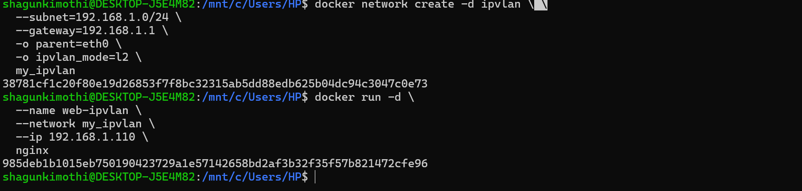

# 🐳 Docker Networking Lab

> Swarm + Overlay Network + IPvlan (WSL Setup)

---

## 📌 Objective

- Initialize Docker Swarm
- Create Overlay Network
- Run container-to-container communication
- Create IPvlan Network
- Assign static IP to container

---

## 🔹 Part 1: Docker Swarm Initialization

### Step 1: Start WSL

```bash
wsl
```

### Step 2: Initialize Swarm

```bash
docker swarm init --advertise-addr 127.0.0.1
```

**✅ Output**
```
Swarm initialized: current node is now a manager.
```

**📖 Explanation**

| Command | Description |
|---|---|
| `docker swarm init` | Enables Swarm mode |
| `--advertise-addr` | IP used for node communication |

> Your system becomes a **Swarm Manager Node**.

---

## 🔹 Part 2: Overlay Network

> Overlay networks allow containers to communicate across swarm nodes.

### Step 3: Create Overlay Network

```bash
docker network create -d overlay --attachable my_overlay
```

**📖 Explanation**

| Flag | Meaning |
|---|---|
| `-d overlay` | Overlay driver |
| `--attachable` | Allows standalone containers to join |
| `my_overlay` | Network name |

### Step 4: Run Containers in Overlay Network

```bash
docker run -d --network my_overlay --name app1 alpine sleep 3600
docker run -d --network my_overlay --name app2 alpine sleep 3600
```

| Flag | Meaning |
|---|---|
| `-d` | Detached mode |
| `alpine` | Lightweight Linux image |
| `sleep 3600` | Keeps container running for 1 hour |

### Step 5: Test Communication

```bash
docker exec app1 ping app2
```


### Screenshots of commands




**✅ Result**

Containers successfully communicated using Docker's internal **DNS resolution**.

---

## 🔹 Part 3: IPvlan Network

> IPvlan gives containers IP addresses from your local LAN.

### Step 6: Create IPvlan Network

```bash
docker network create -d ipvlan \
  --subnet=192.168.1.0/24 \
  --gateway=192.168.1.1 \
  -o parent=eth0 \
  -o ipvlan_mode=l2 \
  my_ipvlan
```

**📖 Explanation**

| Option | Meaning |
|---|---|
| `-d ipvlan` | IPvlan driver |
| `--subnet` | Network range |
| `--gateway` | Router IP |
| `parent=eth0` | Host interface |
| `ipvlan_mode=l2` | Layer 2 mode |

### Step 7: Run Nginx Container with Static IP

```bash
docker run -d \
  --name web-ipvlan \
  --network my_ipvlan \
  --ip 192.168.1.110 \
  nginx
```

**Assigned IP:** `192.168.1.110`

> Your container now has a real **LAN IP address**.

---

## 🔹 Overlay vs IPvlan Comparison

| Feature | Overlay | IPvlan |
|---|---|---|
| Multi-host support | ✅ Yes | ❌ No |
| Swarm required | ✅ Yes | ❌ No |
| Static IP | ❌ No | ✅ Yes |
| Uses NAT | ✅ Yes | ❌ No |
| Best for | Microservices | Direct LAN access |

---

## 🔹 What You Practiced

- ✅ Swarm Manager setup
- ✅ Overlay networking
- ✅ DNS-based container communication
- ✅ IPvlan L2 configuration
- ✅ Static IP assignment
- ✅ Production-style networking