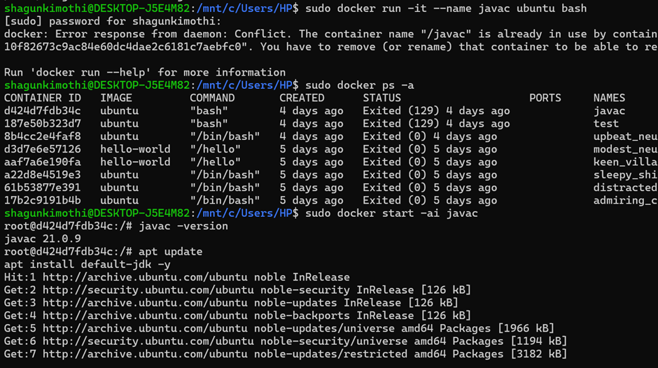
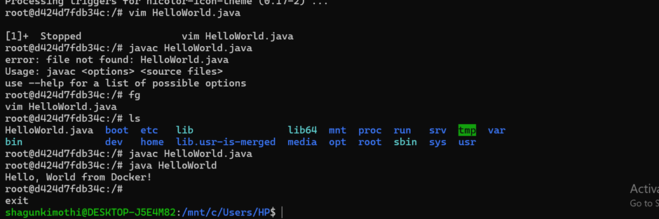

# CONTAINERIZATION AND DEVOPS THEORY

## 23 JANUARY 2026
### MAKING JAVA HELLOWORLD PROGRAM

-

Make a java helloworld program in ubuntu container and compile it with javac.  
Hints:
wsl
sudo docker run -it --name javac ubuntu bash
apt update
apt install default-jdk -y
then vim to create java code and compile and run it

---
### Screenshots of commands

