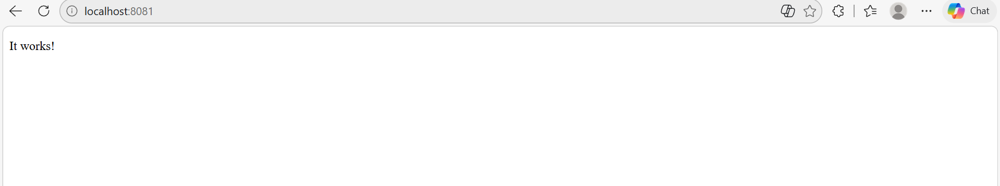
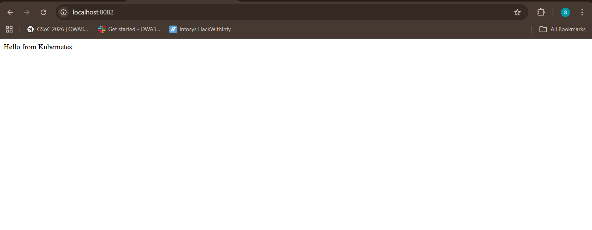
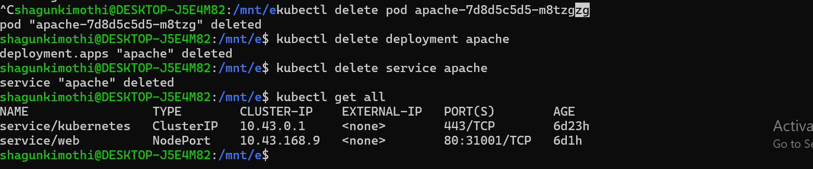

# 🐳 Run and manage hello web app (httpd)— 25 March 2026

A complete walkthrough of core Kubernetes concepts using **k3d** (k3s in Docker) on WSL2.  
Cluster: `k3d-mycluster` · Image: `httpd` (Apache) · Tool: `kubectl`

---

## 📋 Table of Contents

- [Step 1 — Run a Pod](#step-1--run-a-pod)
- [Step 2 — Inspect the Pod](#step-2--inspect-the-pod)
- [Step 3 — Access the App](#step-3--access-the-app)
- [Step 4 — Delete the Pod](#step-4--delete-the-pod)
- [Step 5 — Create a Deployment](#step-5--create-a-deployment)
- [Step 6 — Expose the Deployment](#step-6--expose-the-deployment)
- [Step 7 — Scale the Deployment](#step-7--scale-the-deployment)
- [Step 8 — Test Logs](#step-8--test-logs)
- [Step 9 — Break the App](#step-9--break-the-app)
- [Step 10 — Diagnose](#step-10--diagnose)
- [Step 11 — Fix It](#step-11--fix-it)
- [Step 12 — Exec into a Pod](#step-12--exec-into-a-pod)
- [Step 13 — Delete One Pod](#step-13--delete-one-pod)
- [Step 14 — Cleanup](#step-14--cleanup)
- [Key Takeaways](#key-takeaways)
- [Quick Reference Cheatsheet](#quick-reference-cheatsheet)

---

## Step 1 — Run a Pod

A **Pod** is the smallest deployable unit in Kubernetes. We run an Apache HTTP server (`httpd`) as a bare standalone pod.

```bash
kubectl run apache-pod --image=httpd
kubectl get pods
```

> 💡 Status goes `ContainerCreating` → `Running` as the image is pulled and the container starts.


---

## Step 2 — Inspect the Pod

Use `kubectl describe` to see full pod details: node assignment, pod IP, container state, and the event history.

```bash
kubectl describe pod apache-pod
```

Key fields to note:
- **Node** — which cluster node the pod was scheduled on
- **IP** — the pod's internal cluster IP (`10.42.0.29`)
- **State: Running** — container is healthy
- **Events** — shows image pull duration and container start

> 💡 The Events section is your first stop when debugging any pod issue.


---

## Step 3 — Access the App

Port-forward from your local machine directly to the pod to verify Apache is serving traffic.

```bash
kubectl port-forward pod/apache-pod 8081:80
# Visit → http://localhost:8081
```




> ✅ **"It works!"** — Apache is running inside the pod and reachable from your browser.

---

## Step 4 — Delete the Pod

Standalone pods are **not self-healing**. When deleted, they're gone permanently — no restart.

```bash
kubectl delete pod apache-pod
```


> ⚠️ **Concept:** This is why we use Deployments in practice. A Deployment will automatically recreate a pod if it goes down.

---

## Step 5 — Create a Deployment

A **Deployment** wraps your pod in a controller that ensures it always runs. It creates a **ReplicaSet**, which in turn creates and manages the actual Pod(s).

```bash
kubectl create deployment apache --image=httpd
kubectl get deployments
kubectl get pods
```

Notice the pod name now includes a hash: `apache-7d8d5c5d5-m8tzg`  
→ `apache` (deployment) + `7d8d5c5d5` (ReplicaSet) + `m8tzg` (Pod ID)


---

## Step 6 — Expose the Deployment

A **Service** gives the deployment a stable network endpoint. `NodePort` makes it reachable outside the cluster.

```bash
kubectl expose deployment apache --port=80 --type=NodePort
kubectl port-forward service/apache 8082:80
# Visit → http://localhost:8082
```


> 💡 Port-forwarding to a **Service** (not a pod directly) means traffic is load-balanced across all running replicas automatically.

---

## Step 7 — Scale the Deployment

Scale the deployment up to **2 replicas** to handle more traffic and improve availability.

```bash
kubectl scale deployment apache --replicas=2
kubectl get pods
```

Both pods show `Running` — Kubernetes brought up the second replica automatically.


> 💡 **Declarative scaling:** You declare the *desired state* (2 replicas) and Kubernetes reconciles the actual state to match it.

---

## Step 8 — Test Logs

With 2 replicas running and the service still port-forwarded, verify traffic is being handled.

```bash
kubectl port-forward service/apache 8082:80
kubectl logs <pod-name>
```


> 💡 Use `kubectl logs -f <pod-name>` to stream live logs. With multiple replicas, check each pod's logs individually or use a log aggregator.

---

## Step 9 — Break the App

Simulate a bad deployment by setting a **non-existent image name**:

```bash
kubectl set image deployment/apache httpd=wrongimage
kubectl get pods
```

The new pod enters `ErrImagePull` → `ImagePullBackOff` while the two original pods stay `Running`.


> ✅ **Rolling update safety:** Kubernetes does NOT kill the healthy old pods until the new ones pass health checks. Your app stayed live the whole time!

---

## Step 10 — Diagnose

Investigate the failing pod using `kubectl describe`:

```bash
kubectl describe pod apache-85d55cd9d7-bns4n
```

Look at the **Events** section at the bottom — it shows exactly why the pull failed:  
`pull access denied, repository does not exist`


> 💡 **Debugging checklist for `ErrImagePull`:**
> 1. Is the image name spelled correctly?
> 2. Does the tag exist on Docker Hub / your registry?
> 3. Do you need `imagePullSecrets` for a private registry?

---

## Step 11 — Fix It

Roll back to the correct image name:

```bash
kubectl set image deployment/apache httpd=httpd
```

Kubernetes immediately starts a new rollout with the correct image. The bad pod is replaced and all replicas return to `Running`.


---

## Step 12 — Exec into a Pod

Open an interactive shell inside a running container — useful for debugging or manual testing:

```bash
kubectl exec -it apache-7d8d5c5d5-79hpz -- /bin/bash

# Inside the container:
ls /usr/local/apache2/htdocs
# → index.html

echo "Hello from Kubernetes" > /usr/local/apache2/htdocs/index.html
exit
```


> ⚠️ **Changes made inside a container are ephemeral** — they will be lost when the pod is deleted or restarted. Use **ConfigMaps** or **Volumes** for persistent content.

---

## Step 13 — Delete One Pod
 
After modifying the HTML in one pod, we checked what the other replica was still serving — and the difference is eye-opening:
 
```bash
# Pod 1 — modified manually
kubectl exec -it apache-7d8d5c5d5-79hpz -- cat /usr/local/apache2/htdocs/index.html
# → Hello from Kubernetes
 
# Pod 2 — untouched original
kubectl exec -it apache-7d8d5c5d5-m8tzg -- cat /usr/local/apache2/htdocs/index.html
# → <!DOCTYPE HTML ...> It works! Apache httpd
```
 

 
Then we updated Pod 2 as well and verified via browser that both pods now serve the custom page:
 

 
> ⚠️ This proves that **in-container changes don't sync across replicas**. Each pod has its own isolated filesystem. Pod 1 shows `Hello from Kubernetes`, Pod 2 still shows the original Apache HTML.
 
---
 
## Step 14 — Delete One Pod (Self-Healing Demo)
 
Delete one pod manually — the Deployment notices and immediately recreates it. This is Kubernetes **self-healing** in action.
 
```bash
kubectl delete pod apache-7d8d5c5d5-m8tzg
```
 

 

 
> 💡 The moment you delete a pod owned by a Deployment, the ReplicaSet controller spins up a replacement to maintain the desired replica count.
 
---
 
## Step 15 — Cleanup
 
Remove all resources created during this lab and verify the cluster is back to a clean state.
 
```bash
kubectl delete pod apache-7d8d5c5d5-m8tzg
kubectl delete deployment apache
kubectl delete service apache
kubectl get all
```
 

 
Only the default `service/kubernetes` (ClusterIP) and the pre-existing `service/web` (NodePort) remain — everything from this lab is gone.
 
Only the default `service/kubernetes` and the pre-existing `service/web` remain — the cluster is clean.
 
---
 
## Key Takeaways
 
| Lesson | Detail |
|---|---|
| **Pods ≠ Deployments** | Standalone pods don't self-heal. Always use a Deployment in production. |
| **Rolling updates are safe** | Old pods stay alive until new ones are healthy — zero downtime by default. |
| **Services load-balance** | Port-forward to a Service, not a Pod, to hit all replicas evenly. |
| **Containers are ephemeral** | Files written inside a container are lost on pod restart. Use Volumes. |
| **`describe` is your debugger** | The Events section in `kubectl describe pod` explains almost every failure. |
| **Self-healing works** | Delete a pod managed by a Deployment — it comes back automatically. |
 
---
 
## Quick Reference Cheatsheet
 
```bash
# ── Pods ──────────────────────────────────────────────────
kubectl run <name> --image=<image>             # Create standalone pod
kubectl get pods                                # List all pods
kubectl describe pod <name>                    # Full details + events
kubectl delete pod <name>                      # Delete a pod
kubectl logs <name>                            # View container logs
kubectl logs -f <name>                         # Stream live logs
kubectl exec -it <name> -- /bin/bash           # Shell into container
 
# ── Deployments ───────────────────────────────────────────
kubectl create deployment <name> --image=<image>          # Create
kubectl get deployments                                     # List
kubectl scale deployment <name> --replicas=<n>            # Scale
kubectl set image deployment/<name> <container>=<image>   # Update image
kubectl delete deployment <name>                          # Delete
 
# ── Services ──────────────────────────────────────────────
kubectl expose deployment <name> --port=80 --type=NodePort  # Expose
kubectl get services                                          # List
kubectl delete service <name>                               # Delete
 
# ── Port Forwarding ───────────────────────────────────────
kubectl port-forward pod/<name> <local>:<pod>              # → Pod
kubectl port-forward service/<name> <local>:<svc>          # → Service
 
# ── Debugging ─────────────────────────────────────────────
kubectl describe pod <name>      # Events + full state
kubectl get events               # Cluster-wide events
kubectl get all                  # Everything in the namespace
```
 
---
 

 