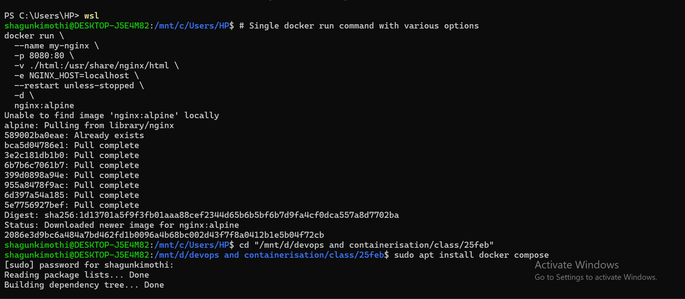
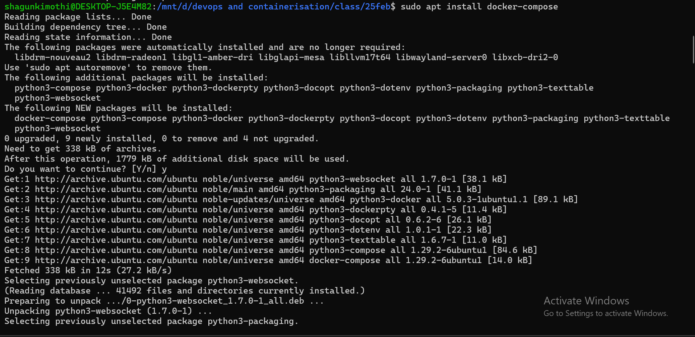
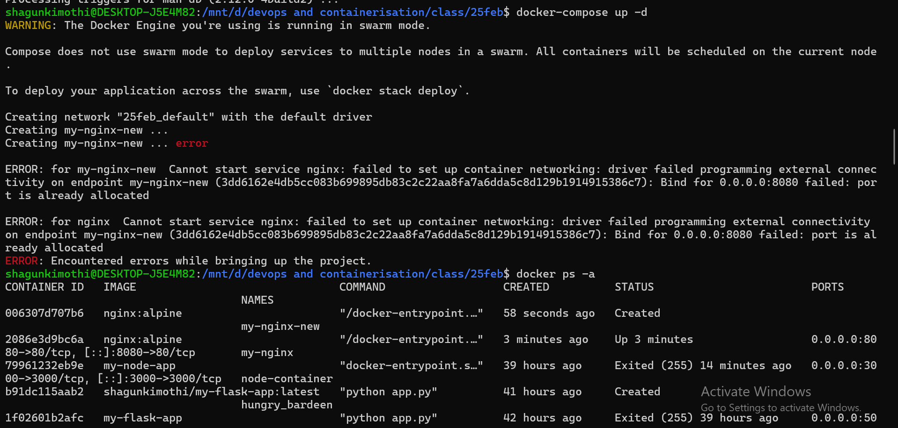
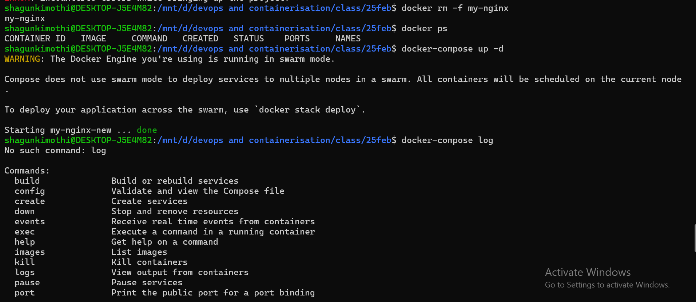
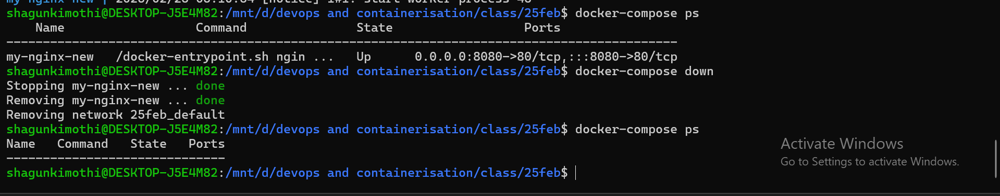
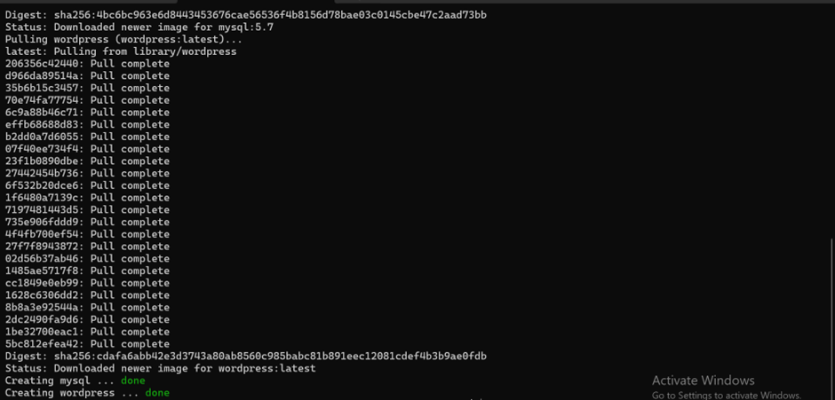
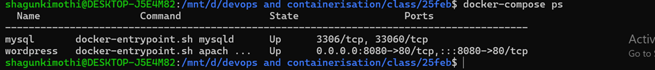
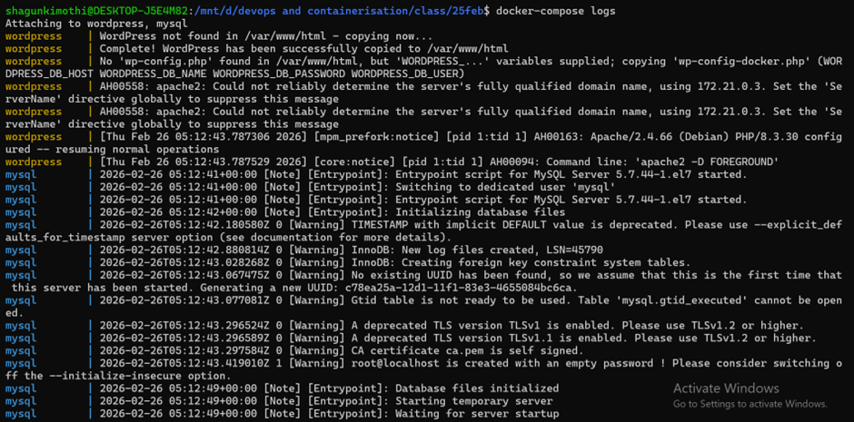
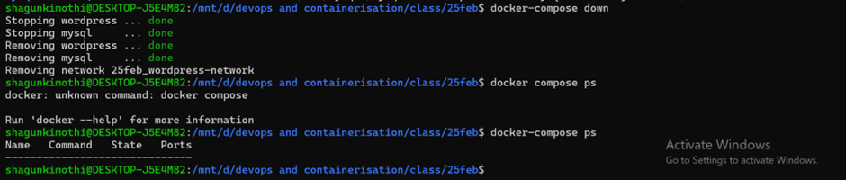

# CONTAINERIZATION AND DEVOPS THEORY

## 25 FEBRUARY 2026  
### Docker Run, Docker Compose, Port Conflict Handling & Multi-Container Setup

---

## 📌 Objective

To understand:

- Running containers with advanced Docker options  
- Using Docker Compose  
- Handling port conflicts  
- Viewing logs and managing services  
- Deploying a multi-container WordPress + MySQL stack  

---

# 🐳 Part 1 — Running NGINX Using Docker

## 🔹 Docker Run Command

```bash
docker run \
  --name my-nginx \
  -p 8080:80 \
  -v ./html:/usr/share/nginx/html \
  -e NGINX_HOST=localhost \
  --restart unless-stopped \
  -d \
  nginx:alpine
```



---

# 🧰 Part 2 — Docker Compose Setup (NGINX)

## 🔹 docker-compose.yml

```yaml
version: '3'

services:
  nginx:
    image: nginx:alpine
    container_name: my-nginx-new
    ports:
      - "8080:80"
    volumes:
      - ./html:/usr/share/nginx/html
    restart: unless-stopped
```



---

# ⚠️ Port Conflict Issue

When running:

```bash
docker-compose up -d
```

Error received:

```
Bind for 0.0.0.0:8080 failed: port is already allocated
```



---

# 🔍 Checking Running Containers

```bash
docker ps
```

Observed that another container was already using port 8080.



---

# 🛠 Resolving Port Conflict

Stopped and removed the conflicting container:

```bash
docker rm -f my-nginx
```

Then started Docker Compose again:

```bash
docker-compose up -d
```



---

# 📜 Viewing Logs

```bash
docker-compose logs
```

Logs confirmed that NGINX started successfully.

---

# 📊 Checking Service Status

```bash
docker-compose ps
```

Confirmed that the service was running on:

```
0.0.0.0:8080 -> 80/tcp
```

---

# 🧹 Stopping Services

```bash
docker-compose down
```

This stopped and removed containers along with the default network.

---

# 🌐 Part 3 — WordPress + MySQL Using Docker Compose

## 📌 Objective

To deploy a multi-container WordPress application connected to a MySQL database using Docker Compose.

---

## 🔹 docker-compose.yml (Multi-Container Setup)

```yaml
version: '3.8'

services:
  mysql:
    image: mysql:5.7
    container_name: mysql
    environment:
      MYSQL_ROOT_PASSWORD: secret
      MYSQL_DATABASE: wordpress
      MYSQL_USER: wpuser
      MYSQL_PASSWORD: wppass
    volumes:
      - mysql_data:/var/lib/mysql
    networks:
      - wordpress-network

  wordpress:
    image: wordpress:latest
    container_name: wordpress
    ports:
      - "8080:80"
    environment:
      WORDPRESS_DB_HOST: mysql
      WORDPRESS_DB_USER: wpuser
      WORDPRESS_DB_PASSWORD: wppass
      WORDPRESS_DB_NAME: wordpress
    volumes:
      - wp_content:/var/www/html/wp-content
    depends_on:
      - mysql
    networks:
      - wordpress-network

volumes:
  mysql_data:
  wp_content:

networks:
  wordpress-network:
```



---

## 🔹 Starting the Multi-Container Application

```bash
docker-compose up -d
```



---

## 🔹 Checking Running Services

```bash
docker-compose ps
```

Confirmed both containers are running:

- mysql  
- wordpress  


---

## 🔹 Viewing Logs

```bash
docker-compose logs
```

Verified MySQL initialization and WordPress startup.


---

## 🔹 Accessing WordPress

Opened browser:

```
http://localhost:8080
```

WordPress setup page appeared successfully.



---

## 🔹 WordPress Dashboard / Final Output

After configuration, WordPress site loaded successfully.



---

# 🧠 Key Concepts Learned

- Docker Compose manages multi-container applications  
- Service names act as internal DNS (wordpress connects to mysql)  
- Named volumes provide persistent storage  
- Custom networks isolate application services  
- Port conflicts must be handled before deployment  
- Logs help debug container issues  

---

# ✅ Final Conclusion

This experiment demonstrated:

- Single container deployment using `docker run`  
- Container orchestration using Docker Compose  
- Debugging port conflicts  
- Multi-container application deployment  
- Networking and volume management in Docker  

This lab provides practical experience in real-world container lifecycle and service orchestration using Docker and Docker Compose.