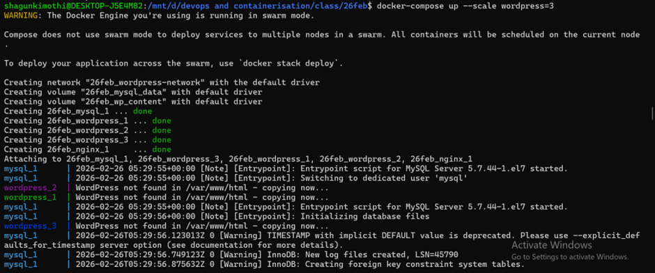
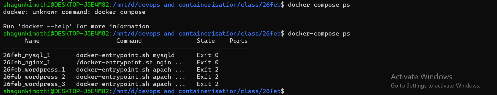

# CONTAINERIZATION AND DEVOPS THEORY

## 26 FEBRUARY 2026  
### Scaling WordPress with Docker Compose

---

## 📌 Objective

To understand:

- Service scaling using Docker Compose  
- Running multiple WordPress instances  
- Verifying scaled containers  
- Understanding load balancing conceptually  

---

# 🚀 Part 1 — Docker Compose Scaling

## 🔹 Basic Scaling Command

```bash
docker compose up --scale web=3 --scale worker=2
```

### 📖 What This Command Does:

- `up` → Creates and starts containers  
- `--scale web=3` → Runs 3 instances of the web service  
- `--scale worker=2` → Runs 2 instances of the worker service  

This demonstrates horizontal scaling of services.



---

# 🌐 Part 2 — Scaling WordPress to Multiple Instances

## 🔹 Scale WordPress

```bash
docker compose up --scale wordpress=3 -d
```

This command runs **3 WordPress containers**.

---

## 🔹 Verify Running Containers

```bash
docker compose ps
```

Expected output:

```
wordpress-wordpress-1   80/tcp
wordpress-wordpress-2   80/tcp
wordpress-wordpress-3   80/tcp
wordpress-nginx-1       0.0.0.0:8080->80/tcp
wordpress-mysql-1       3306/tcp
```



---

# 🏗 Architecture Overview

```
User Request
    ↓
Port 8080 (Host)
    ↓
NGINX
    ↓
wordpress-1
wordpress-2
wordpress-3
    ↓
MySQL
    ↓
Shared Volume
```

---

# 🔎 Commands Used

### Start Services
```bash
docker compose up -d
```

### Scale WordPress
```bash
docker compose up --scale wordpress=3 -d
```

### Check Running Containers
```bash
docker compose ps
```

### Stop Services
```bash
docker compose down
```

---

# ⚡ Key Concepts Learned

- Horizontal scaling using Docker Compose  
- Running multiple container replicas  
- Internal Docker networking  
- Container verification using `docker compose ps`  
- Real-world scalable architecture basics  

---

# ✅ Conclusion

In this session, we implemented service scaling using Docker Compose and verified multiple running WordPress instances.

This experiment demonstrates how Docker enables horizontal scaling and container-based architecture design.