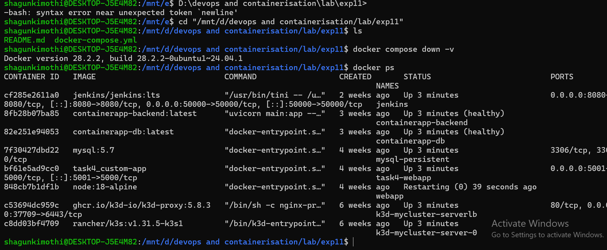
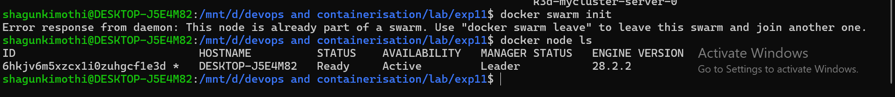
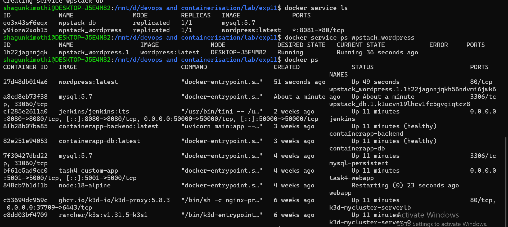
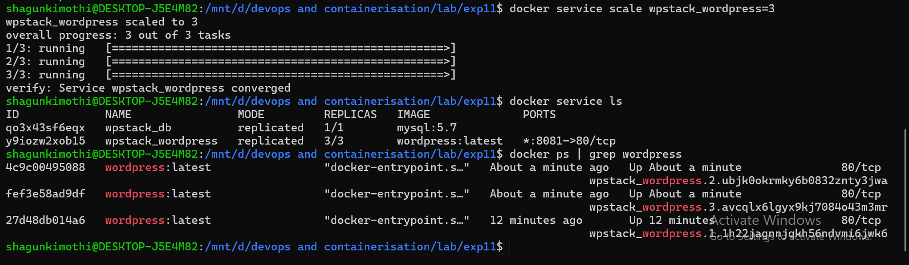
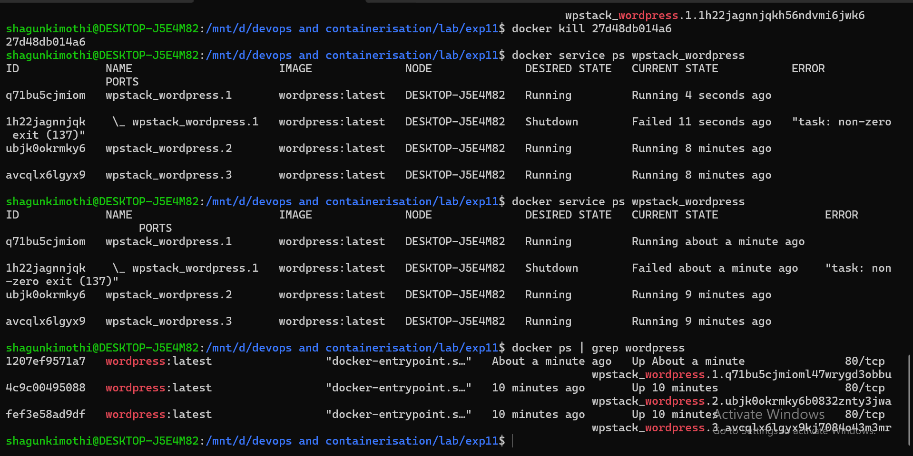
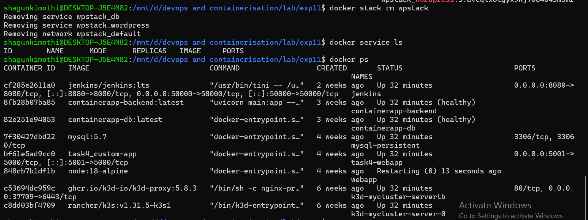

# 🐳 Exp 11: Orchestration using Docker Compose and Docker Swarm
## Part B – Continuation of Experiment 6

---

## 📌 Objective

To deploy a multi-container WordPress application using Docker Compose and Docker Swarm, verify its execution, scale the service, and demonstrate self-healing capabilities.

---

## 🛠️ Prerequisites

- Docker installed (Swarm enabled)
- WSL / Linux environment
- `docker-compose.yml` file

---

## 📂 Project Structure

```
exp11/
│── docker-compose.yml
│── README.md
│── Task1.png
│── Task2.png
│── Task3.png
│── Task4.png
│── Task5.png
│── Task6.png
│── Task7.png
│── Task8.png
```

---

## 🧾 Docker Compose File

```yaml
version: '3.9'

services:
  db:
    image: mysql:5.7
    container_name: wordpress_db
    restart: always
    environment:
      MYSQL_ROOT_PASSWORD: rootpass
      MYSQL_DATABASE: wordpress
      MYSQL_USER: wpuser
      MYSQL_PASSWORD: wppass
    volumes:
      - db_data:/var/lib/mysql

  wordpress:
    image: wordpress:latest
    container_name: wordpress_app
    depends_on:
      - db
    ports:
      - "8081:80"
    restart: always
    environment:
      WORDPRESS_DB_HOST: db:3306
      WORDPRESS_DB_USER: wpuser
      WORDPRESS_DB_PASSWORD: wppass
      WORDPRESS_DB_NAME: wordpress
    volumes:
      - wp_data:/var/www/html

volumes:
  db_data:
  wp_data:
```

---

## 🚀 Task 1: Check Current State

```bash
docker compose down -v
docker ps
```

**Output:**



---

## ⚙️ Task 2: Initialize Docker Swarm

```bash
docker swarm init
docker node ls
```

**Output:**



---

## 📦 Task 3: Deploy Stack

```bash
docker stack deploy -c docker-compose.yml wpstack
```

**Output:**


---

## 🔍 Task 4: Verify Deployment

```bash
docker service ls
docker ps
```

**Output:**



---

## 🌐 Task 5: Access WordPress

Open in browser:

```
http://localhost:8081
```

**Output:**


---

## 📈 Task 6: Scale Application

```bash
docker service scale wpstack_wordpress=3
```

**Output:**



---

## 🔁 Task 7: Self-Healing

```bash
docker ps | grep wordpress
docker kill <container_id>
docker service ps wpstack_wordpress
```

**Output:**



---

## 🧹 Task 8: Cleanup

```bash
docker stack rm wpstack
```

**Output:**



---

## 🧠 Conclusion

- ✅ Successfully deployed WordPress using Docker Swarm
- ✅ Verified deployment and service execution
- ✅ Demonstrated scaling from 1 to 3 replicas
- ✅ Verified self-healing capability
- ✅ Understood container orchestration

---

## 🎯 Key Learnings

- Docker Swarm manages services instead of individual containers
- Supports scaling and load balancing
- Maintains desired state automatically
- Enables self-healing of failed containers

---

## 🏁 Result

| Task | Status |
|------|--------|
| Deployment | ✔ Successful |
| Scaling | ✔ Successful |
| Self-Healing | ✔ Verified |
| Experiment | ✔ Completed Successfully |