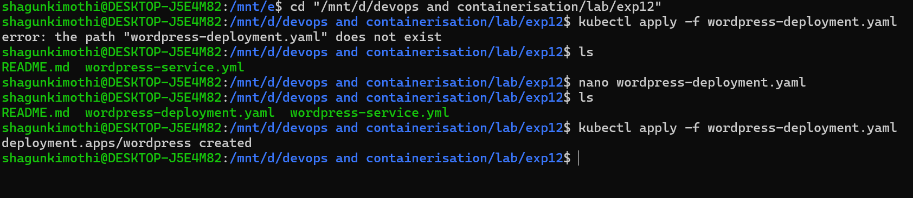
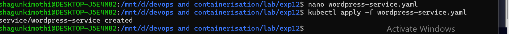
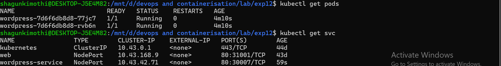
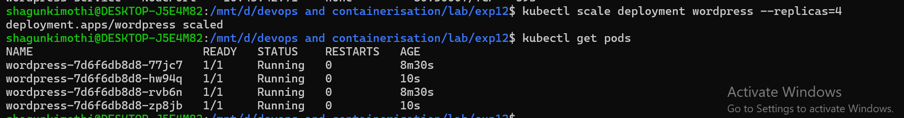
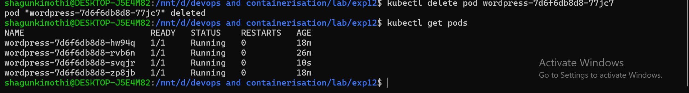

# 🧪 Experiment 12 — Container Orchestration using Kubernetes

> **Objective:** Deploy a WordPress application on Kubernetes, expose it using a Service, scale it, and demonstrate Kubernetes self-healing capability.

---

## ⚙️ Prerequisites

| Requirement | Details |
|---|---|
| Kubernetes Cluster | Minikube / K3s / Docker Desktop |
| kubectl | Installed and configured |
| Terminal | WSL / Linux terminal |

---

## 📁 Project Structure

```
.
├── wordpress-deployment.yaml
├── wordpress-service.yaml
└── README.md
```

---

## 🚀 Task 1 — Create Deployment

Create a Deployment manifest to run WordPress pods with 2 replicas.

### `wordpress-deployment.yaml`

```yaml
apiVersion: apps/v1
kind: Deployment
metadata:
  name: wordpress
spec:
  replicas: 2
  selector:
    matchLabels:
      app: wordpress
  template:
    metadata:
      labels:
        app: wordpress
    spec:
      containers:
        - name: wordpress
          image: wordpress:latest
          ports:
            - containerPort: 80
```

### Apply the Deployment

```bash
kubectl apply -f wordpress-deployment.yaml
```

### Verify Running Pods

```bash
kubectl get pods
```

### ✅ Expected Output

```
NAME                         READY   STATUS    RESTARTS   AGE
wordpress-xxxxxxxxx-xxxxx    1/1     Running   0          30s
wordpress-xxxxxxxxx-yyyyy    1/1     Running   0          30s
```

> 2 pods running (replicas = 2)

### 📸 Screenshot — Task 1



---

## 🌐 Task 2 — Create Service (NodePort)

Expose the WordPress deployment externally using a NodePort Service.

### `wordpress-service.yaml`

```yaml
apiVersion: v1
kind: Service
metadata:
  name: wordpress-service
spec:
  type: NodePort
  selector:
    app: wordpress
  ports:
    - protocol: TCP
      port: 80
      targetPort: 80
      nodePort: 30007
```

### Apply the Service

```bash
kubectl apply -f wordpress-service.yaml
```

### Verify Service

```bash
kubectl get svc
```

### ✅ Expected Output

```
NAME                TYPE       CLUSTER-IP     EXTERNAL-IP   PORT(S)        AGE
wordpress-service   NodePort   10.96.x.x      <none>        80:30007/TCP   10s
```

### Access the Application

```
http://localhost:30007
```

### 📸 Screenshot — Task 2



---

## 📈 Task 3 — Scale the Deployment

Scale the WordPress deployment from **2 replicas → 4 replicas**.

### Scale Command

```bash
kubectl scale deployment wordpress --replicas=4
```

### Verify Scaled Pods

```bash
kubectl get pods
```

### ✅ Expected Output

```
NAME                         READY   STATUS    RESTARTS   AGE
wordpress-xxxxxxxxx-aaaaa    1/1     Running   0          2m
wordpress-xxxxxxxxx-bbbbb    1/1     Running   0          2m
wordpress-xxxxxxxxx-ccccc    1/1     Running   0          15s
wordpress-xxxxxxxxx-ddddd    1/1     Running   0          15s
```

> 4 pods running after scaling

### 📸 Screenshot — Task 3



---

## 🔁 Task 4 — Load Distribution

With multiple replicas running, Kubernetes automatically distributes incoming traffic across all available pods via the Service.

### How It Works

```
Client Request
      │
      ▼
 [ Service ]  ──── Round-Robin / Random ────►  [ Pod 1 ]
                                          ├──► [ Pod 2 ]
                                          ├──► [ Pod 3 ]
                                          └──► [ Pod 4 ]
```

### Verify Load Balancing (Optional)

```bash
# Watch pod logs to observe traffic distribution
kubectl logs -f <pod-name>

# Or describe the service endpoints
kubectl describe svc wordpress-service
```

### ✅ Key Points

- No manual configuration required — handled automatically by the Service
- Traffic is distributed across all healthy pods
- Unhealthy pods are removed from the load balancer pool

### 📸 Screenshot — Task 4



---

## ♻️ Task 5 — Self-Healing Demonstration

Kubernetes automatically detects and replaces failed or manually deleted pods to maintain the desired replica count.

### Step 1 — List Current Pods

```bash
kubectl get pods
```

### Step 2 — Delete a Pod (Simulate Failure)

```bash
kubectl delete pod <pod-name>
```

> Replace `<pod-name>` with an actual pod name from Step 1, e.g., `wordpress-xxxxxxxxx-aaaaa`

### Step 3 — Verify Self-Healing

```bash
kubectl get pods
```

### ✅ Expected Observation

```
NAME                         READY   STATUS              RESTARTS   AGE
wordpress-xxxxxxxxx-bbbbb    1/1     Running             0          5m
wordpress-xxxxxxxxx-ccccc    1/1     Running             0          5m
wordpress-xxxxxxxxx-ddddd    1/1     Running             0          5m
wordpress-xxxxxxxxx-eeeee    0/1     ContainerCreating   0          2s   ← NEW pod
```

> - Deleted pod is **automatically recreated** by the ReplicaSet controller
> - Total pod count remains constant at **4**
> - Recovery happens within seconds

### 📸 Screenshot — Task 5



---

## 🧠 Key Concepts

| Concept | Description |
|---|---|
| **Deployment** | Manages pod lifecycle, rolling updates, and desired state |
| **ReplicaSet** | Ensures the specified number of pod replicas are always running |
| **Service (NodePort)** | Exposes the application on a static port accessible outside the cluster |
| **Scaling** | Dynamically adjust replica count with `kubectl scale` |
| **Self-Healing** | Kubernetes ReplicaSet automatically restarts or replaces failed pods |

---

## ⚠️ Notes

- WordPress requires a **MySQL database** for full functionality
- In this experiment, the database is **not configured** (demo/lab purposes only)
- For production use, configure a persistent MySQL deployment alongside WordPress

---

## 🎯 Conclusion

This experiment successfully demonstrated:

- ✅ Deploying WordPress on a Kubernetes cluster
- ✅ Exposing the application externally via a NodePort Service
- ✅ Dynamically scaling the deployment from 2 to 4 replicas
- ✅ Kubernetes self-healing by automatically replacing deleted pods

---

## Future Improvements

- [ ] Add a **MySQL** database deployment with Secrets for credentials
- [ ] Use **Persistent Volumes (PV/PVC)** for data durability
- [ ] Configure **Ingress** for domain-based access
- [ ] Implement **Horizontal Pod Autoscaler (HPA)** for auto-scaling based on CPU/memory
- [ ] Add **ConfigMaps** for WordPress environment configuration
- [ ] Set up **Liveness and Readiness Probes** for better health monitoring

---

