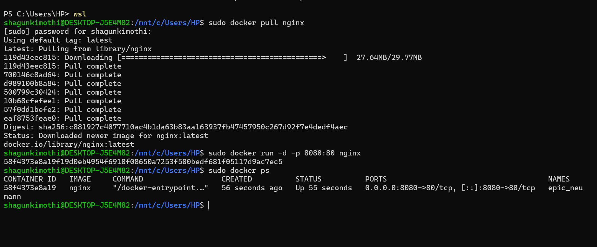
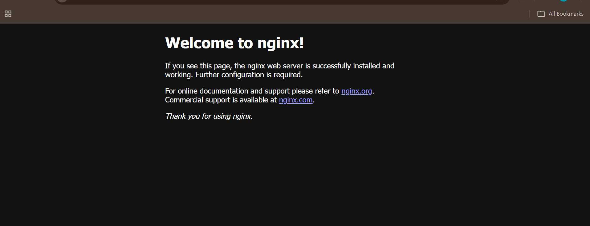
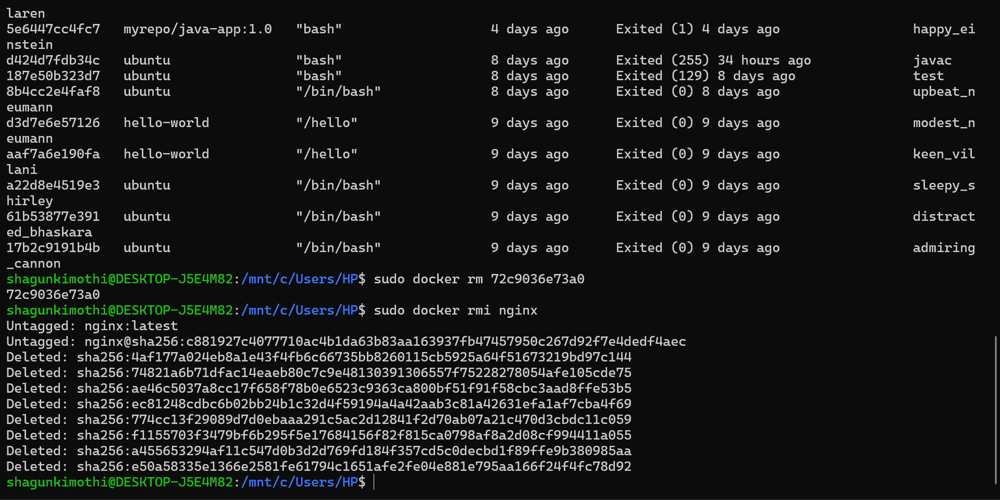
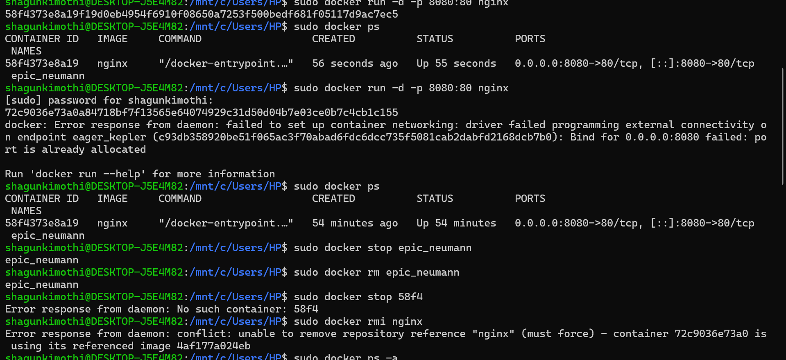

# Docker Experiment 2 — Installation, Configuration & Container Lifecycle

## Overview
This experiment demonstrates the practical implementation of containerization using Docker. The goal is to understand how Docker images are pulled, containers are deployed, services are exposed using port mapping, and how the complete container lifecycle is managed.

Containers provide lightweight, fast, and portable environments compared to traditional virtual machines. This lab focuses on real-world Docker CLI operations used in DevOps and Cloud environments.

---

## Objectives
- Understand Docker architecture
- Pull images from Docker Hub
- Run containers in detached mode
- Configure port mapping
- Verify running containers
- Stop and remove containers
- Remove unused Docker images
- Observe port conflict behavior

---

## System Requirements

| Component | Details |
|---|---|
| OS | Windows / Linux / macOS |
| Software | Docker Desktop |
| Network | Active Internet connection |
| Interface | Terminal / PowerShell |

---

## Docker Concepts Used

| Concept | Explanation |
|---|---|
| Image | Read-only template used to create containers |
| Container | Running instance of an image |
| Port Mapping | Connects host port to container port |
| Detached Mode | Runs container in background |
| Docker Hub | Public image repository |

---

## Step-by-Step Procedure

### Step 1 — Pull nginx Image
```bash
docker pull nginx
```

Downloads the official nginx web server image from Docker Hub.



---

### Step 2 — Run Container with Port Mapping
```bash
docker run -d -p 8080:80 nginx
```

| Option | Meaning |
|---|---|
| `-d` | Detached mode — runs in background |
| `-p 8080:80` | Maps host port 8080 → container port 80 |
| `nginx` | Image name |

Now open: **http://localhost:8080**



---

### Step 3 — Verify Running Containers
```bash
docker ps
```

Displays container ID, image, status, and port mappings.

---

### Step 4 — Stop Container
```bash
docker stop <container_id>
```

---

### Step 5 — Remove Container
```bash
docker rm <container_id>
```

---

### Step 6 — Remove Docker Image
```bash
docker rmi nginx
```



---

## Observed Behavior

- Docker prevents multiple containers from using the same host port
- Images cannot be deleted if containers still reference them
- Port mapping enables browser access from host machine



---

## Results

The nginx image was pulled, container deployed, verified, stopped, removed, and the image deleted successfully.

---

## Conclusion

Docker simplifies application deployment using containers. Compared to VMs, containers start faster, consume fewer resources, and are ideal for cloud-native microservices.

---

## Key Takeaways

| Concept | Learning |
|---|---|
| Containers vs VMs | Containers are lightweight and faster to start |
| Port Mapping | Essential for accessing services from host |
| Docker Lifecycle | Pull → Run → Verify → Stop → Remove |
| Port Conflicts | One host port can only be used by one container |
| Image Deletion | Must remove container before removing image |