# Experiment 9: Ansible 

---

## 📋 Problem Statement

Managing infrastructure manually across multiple servers leads to **configuration drift**, inconsistent environments, and time-consuming repetitive tasks. Scaling from one server to hundreds becomes nearly impossible with manual SSH-based administration.

---

## 🔍 Theory

### What is Ansible?

Ansible is an open-source automation tool for **configuration management**, **application deployment**, and **orchestration**.

- Follows an **agentless architecture**, using SSH for Linux and WinRM for Windows
- Uses **YAML-based playbooks** to define automation tasks
- Industry-standard choice among enterprise automation solutions for cross-platform automation and orchestration at scale

### How Ansible Solves the Problem

| Feature | Description |
|---|---|
| **Agentless Architecture** | No software installation required on managed nodes |
| **Idempotency** | Running playbooks multiple times yields the same result |
| **Declarative Syntax** | Describe desired state, not the steps to achieve it |
| **Push-based** | Initiates changes from control node immediately |

### Key Concepts

| Component | Description |
|---|---|
| **Control Node** | Machine with Ansible installed |
| **Managed Nodes** | Target servers (no Ansible agent needed) |
| **Inventory** | Defines the list of managed nodes (e.g., `inventory.ini`) |
| **Playbooks** | YAML files containing a sequence of automation steps |
| **Tasks** | Individual actions in playbooks (e.g., installing a package) |
| **Modules** | Built-in functionality to perform tasks (e.g., `yum`, `apt`, `service`) |
| **Roles** | Pre-defined reusable automation scripts |

### How Does Ansible Work?

Ansible connects from the **control node** to **managed nodes**, sending commands and instructions. The units of code executed on managed nodes are called **modules**. Each module is invoked by a **task**, and an ordered list of tasks forms a **playbook**.

- No extra agents required on managed nodes
- Only requirements: a terminal and a text editor
- Uses simple, human-readable **YAML** syntax

### Benefits of Using Ansible

- ✅ Free and open-source with a huge community
- ✅ Battle-tested as a preferred IT automation tool
- ✅ Easy to use without special coding skills
- ✅ Simple deployment workflow without extra agents
- ✅ Supports modularity and reusability
- ✅ Extensive official documentation

---

## Part A: Ansible Installation

### 1. Install via apt (Debian/Ubuntu)

Update the system package list, install Ansible, and verify the installation:

```bash
sudo apt update
sudo apt install ansible -y
ansible --version
```

The output confirms **ansible [core 2.16.3]** is installed successfully.

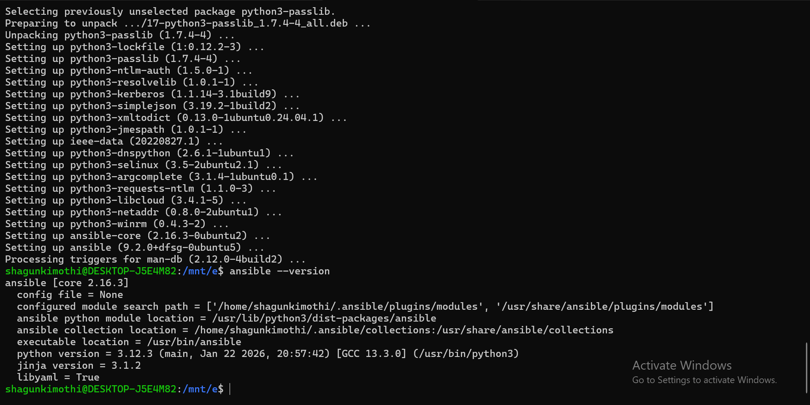

---

### 2. Post Installation Check

Test Ansible on the local control node before connecting to remote servers:

```bash
ansible localhost -m ping
```

Expected output: `localhost | SUCCESS` with `"ping": "pong"`.

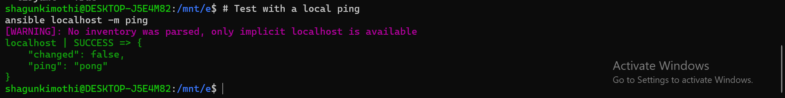

---

## Part B: Create Docker Image and Test SSH Login

### 1. Create SSH Key Pair in WSL

Generate a 4096-bit RSA SSH key pair (or ED25519):

```bash
ssh-keygen -t rsa -b 4096
# or
ssh-keygen -t ed25519
```

### 2. Copy Keys to Working Directory

```bash
cp ~/.ssh/id_ed25519.pub .
cp ~/.ssh/id_ed25519 .
```

### 3. Create Dockerfile for Ubuntu SSH Server

Create a `Dockerfile` that sets up an SSH-enabled Ubuntu container with:
- OpenSSH server installed
- Root login permitted
- Public key authentication enabled
- Your public key added to `authorized_keys`

### 4. Build Docker Image

Builds the SSH-enabled Ubuntu image (all 11 steps complete successfully):

```bash
docker build -t ubuntu-server .
```

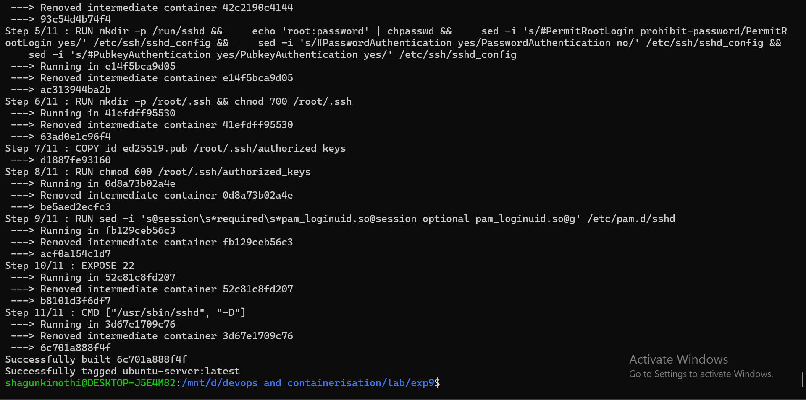

---

### 5. Run Docker Container

Runs the container with SSH exposed on port 2222:

```bash
docker run -d --rm -p 2222:22 --name ssh-test-server ubuntu-server
```

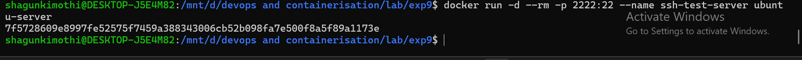

---

### 6. Find Container IP Address

```bash
docker inspect -f '{{range .NetworkSettings.Networks}}{{.IPAddress}}{{end}}' ssh-test-server
```

Returns IP `172.17.0.2`.


---

### 7. Test SSH Connection (Key-Based Authentication)

```bash
ssh -i ~/.ssh/id_ed25519 root@localhost -p 2222
```

Accepts fingerprint, logs into Ubuntu 24.04.3 LTS, confirms `whoami` returns `root`, then exits.

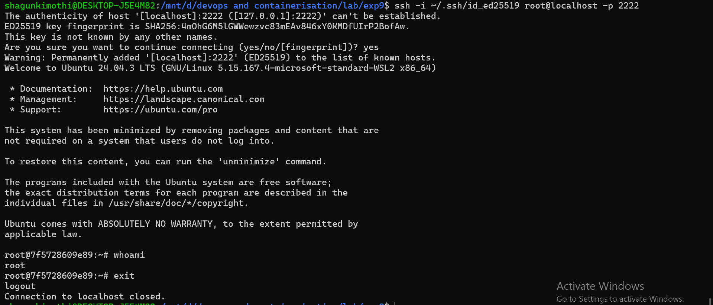

---

### 8. Cleanup

```bash
docker stop ssh-test-server
docker rm ssh-test-server
```

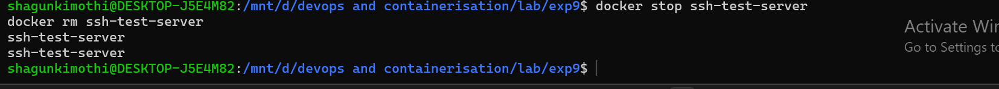

---

## Part C: Ansible with Docker

### 1. Start Multiple Containers as Servers

Creates 4 server containers and prints each container's IP:

```bash
for i in {1..4}; do
  echo -e "\n Creating server${i}\n"
  docker run -d --rm -p 220${i}:22 --name server${i} ubuntu-server
  echo -e "IP of server${i} is $(docker inspect -f '{{range .NetworkSettings.Networks}}{{.IPAddress}}{{end}}' server${i})"
done
```

- server1 → `172.17.0.2`
- server2 → `172.17.0.3`
- server3 → `172.17.0.4`
- server4 → `172.17.0.5`

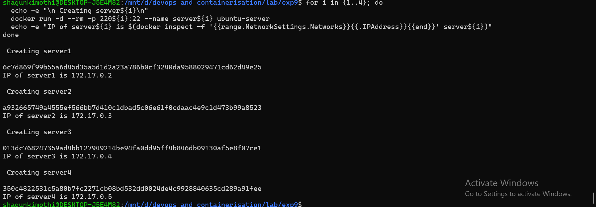

---

### 2–4. Create Ansible Inventory File

Build `inventory.ini` with server IPs and connection variables, then verify:

```bash
echo "[servers]" > inventory.ini
for i in {1..4}; do
  docker inspect -f '{{range .NetworkSettings.Networks}}{{.IPAddress}}{{end}}' server${i} >> inventory.ini
done

cat << EOF >> inventory.ini

[servers:vars]
ansible_user=root
ansible_ssh_private_key_file=/home/shagunkimothi/.ssh/id_ed25519
ansible_python_interpreter=/usr/bin/python3
EOF

cat inventory.ini
```

The resulting `inventory.ini` lists all 4 IPs under `[servers]` with vars defined below.

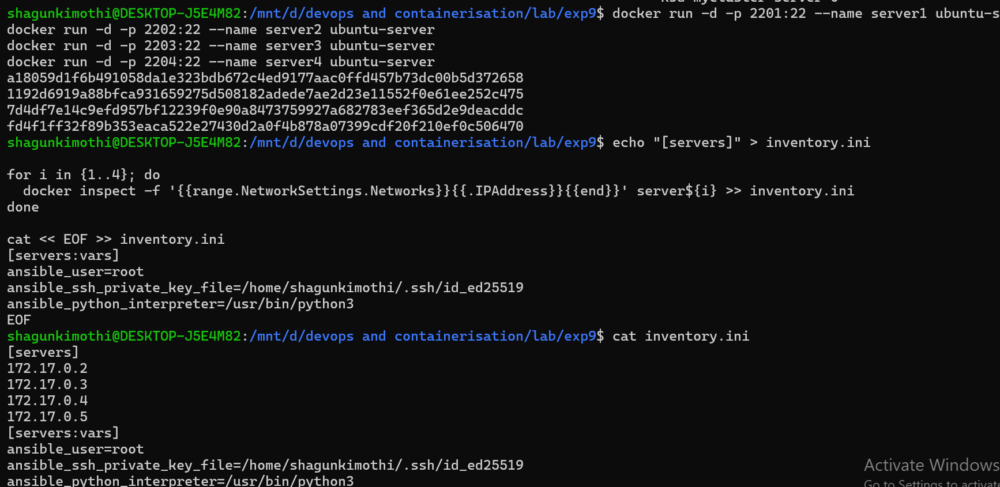

---

### 5. Manual SSH Test to a Container

Verify SSH connectivity to one of the servers manually:

```bash
ssh -i ~/.ssh/id_ed25519 root@localhost -p 2202
```

Successfully logs into server1 (Ubuntu 24.04.3 LTS) and exits cleanly.

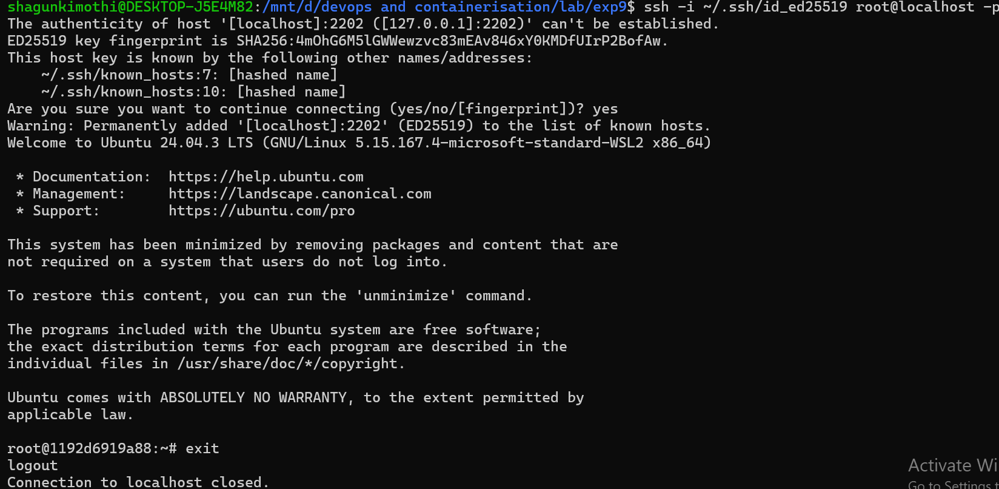

---

### 6–8. Create and Run Playbook (`update.yml`)

Create `update.yml` playbook, then run it against all servers:

```bash
ansible-playbook -i inventory.ini update.yml
```

Ansible gathers facts from all 4 nodes (`172.17.0.2`–`172.17.0.5`), accepting host fingerprints and executing tasks.

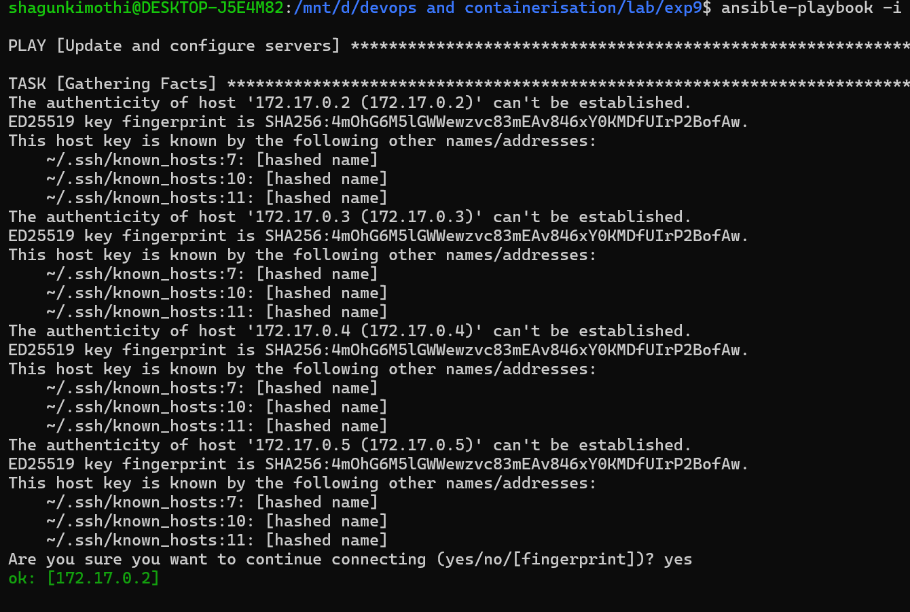

---

### 9–10. Verify Changes

**Via Ansible:**
```bash
ANSIBLE_HOST_KEY_CHECKING=False ansible all -i inventory.ini -m command -a "cat /root/ansible_test.txt"
```

**Via Docker exec:**
```bash
for i in {1..4}; do
  docker exec server${i} cat /root/ansible_test.txt
done
```

All 4 servers return: `Configured by Ansible on 172.17.0.x` ✅

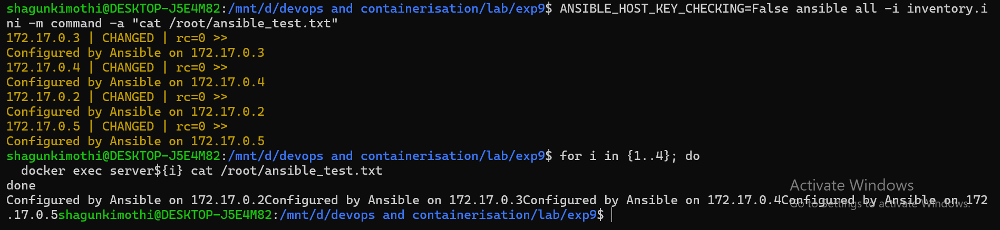

---

### 11. Cleanup

Remove all 4 containers:

```bash
for i in {1..4}; do docker rm -f server${i}; done
```

Outputs `server1`, `server2`, `server3`, `server4` confirming removal.

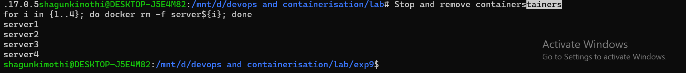

---

## ✅ Conclusion

In this experiment, **Docker containers** were used as managed servers and configured using **Ansible**. SSH key-based authentication was implemented, an inventory file was created with 4 nodes, and automation was achieved using a playbook that wrote a file across all nodes simultaneously — demonstrating how Ansible enables consistent, scalable infrastructure management without manual intervention on each server.

---