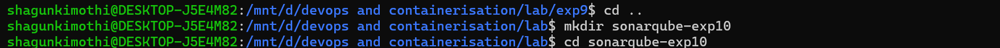
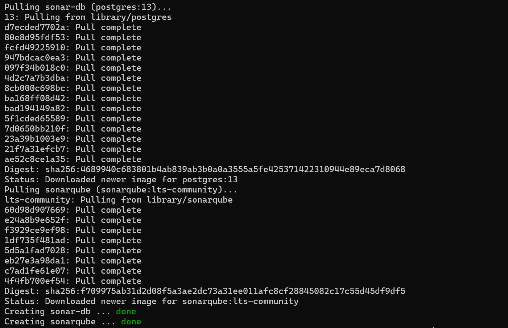
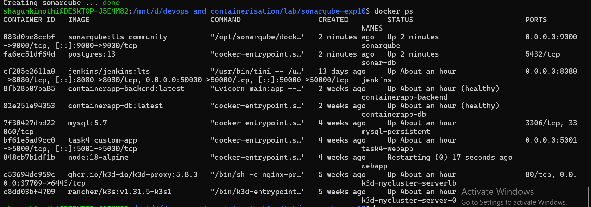
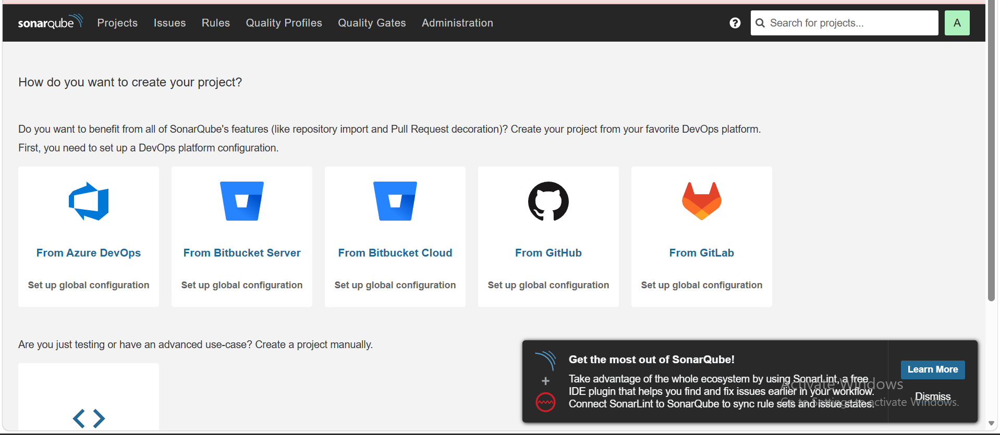
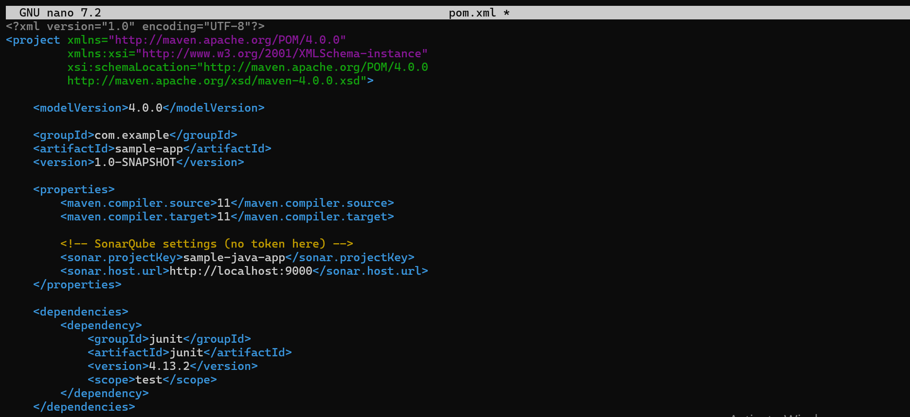
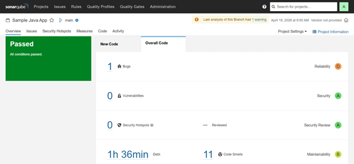
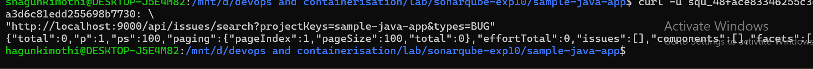

# Experiment 10 — Continuous Code Quality Inspection with SonarQube

## Problem Statement

Code quality issues (bugs, vulnerabilities, code smells) are often discovered late in the development cycle, making them expensive to fix. Manual code reviews are inconsistent and do not scale.

---

## What is SonarQube?

SonarQube is an open-source platform for **continuous inspection of code quality**. It performs automatic reviews using static analysis to detect bugs, code smells, and security vulnerabilities across 20+ programming languages.

---

## How SonarQube Solves the Problem

| Feature | Description |
|---|---|
| **Continuous Inspection** | Scans code with every commit, providing immediate feedback |
| **Quality Gates** | Defines pass/fail criteria before deployment |
| **Technical Debt** | Quantifies the effort needed to fix all issues |
| **Multi-language Support** | Supports 20+ programming languages |
| **Visual Analytics** | Dashboard showing code quality metrics and trends |

---

## Key Concepts

- **Quality Gate** — Set of conditions that code must meet before deployment
- **Technical Debt** — Estimated time to fix all issues
- **Code Smells** — Maintainability issues that don't affect functionality
- **Vulnerabilities** — Security-related issues
- **Bugs** — Code that might break or behave unexpectedly
- **Coverage** — Percentage of code covered by tests
- **Duplications** — Repeated code blocks

---

## Lab Architecture

```
Developer (Source Code)
        │
        ▼
Sonar Scanner (CLI / Maven / CI)
        │
        ▼
SonarQube Server
(Analysis Engine, Quality Gates, Dashboard)
        │
        ▼
PostgreSQL Database
```

---

## Prerequisites

- Docker and Docker Compose installed
- Port `9000` available on localhost

---

## Step-by-Step Setup

### Step 1 — Create Experiment Directory

```bash
mkdir sonarqube-exp10
cd sonarqube-exp10
```



---

### Step 2 — Create `docker-compose.yml`

Create the file with the following content:

```yaml
version: '3.8'

services:
  sonar-db:
    image: postgres:13
    container_name: sonar-db
    restart: unless-stopped
    environment:
      POSTGRES_USER: sonar
      POSTGRES_PASSWORD: sonar
      POSTGRES_DB: sonarqube
    volumes:
      - sonar-db-data:/var/lib/postgresql/data
    networks:
      - sonarqube-lab

  sonarqube:
    image: sonarqube:lts-community
    container_name: sonarqube
    restart: unless-stopped
    depends_on:
      - sonar-db
    ports:
      - "9000:9000"
    environment:
      SONAR_JDBC_URL: jdbc:postgresql://sonar-db:5432/sonarqube
      SONAR_JDBC_USERNAME: sonar
      SONAR_JDBC_PASSWORD: sonar
    volumes:
      - sonar-data:/opt/sonarqube/data
      - sonar-extensions:/opt/sonarqube/extensions
    networks:
      - sonarqube-lab

volumes:
  sonar-db-data:
  sonar-data:
  sonar-extensions:

networks:
  sonarqube-lab:
    driver: bridge
```



---

### Step 3 — Start Containers

```bash
docker-compose up -d
```



---

### Step 4 — Verify Running Containers

```bash
docker ps
```


---

### Step 5 — Create Sample Java Application

Create the project folder structure:

```bash
mkdir -p sample-java-app/src/main/java/com/example
cd sample-java-app
```

Create `src/main/java/com/example/Calculator.java` with intentional code issues for analysis:

```java
package com.example;

import java.util.ArrayList;
import java.util.List;

public class Calculator {

    // BUG: No check for division by zero
    public int divide(int a, int b) {
        return a / b;
    }

    // CODE SMELL: Unused variable 'unused'
    public int add(int a, int b) {
        int result = a + b;
        int unused = 100;
        return result;
    }

    // VULNERABILITY: SQL Injection risk
    public String getUser(String userId) {
        String query = "SELECT * FROM users WHERE id = " + userId;
        return query;
    }

    public int multiply(int a, int b) {
        int result = 0;
        for (int i = 0; i < b; i++) {
            result = result + a;
        }
        return result;
    }

    // CODE SMELL: Exact duplicate of multiply()
    public int multiplyAlt(int a, int b) {
        int result = 0;
        for (int i = 0; i < b; i++) {
            result = result + a;
        }
        return result;
    }

    // CODE SMELL: Too many parameters
    public void processUser(String name, String email, String phone,
                           String address, String city, String state,
                           String zip, String country) {
        System.out.println("Processing: " + name);
    }

    public String getName(String name) {
        return name.toUpperCase();
    }

    // BUG: Empty catch block swallows exception silently
    public void riskyOperation() {
        try {
            int x = 10 / 0;
        } catch (Exception e) {
        }
    }
}
```

> **Note:** This file is intentionally written with bugs, vulnerabilities, and code smells to demonstrate SonarQube's detection capabilities.



---

### Step 6 — Install SonarQube Scanner

Run the scanner as a Docker container connected to the same network:

```bash
docker run -d \
  --name sonar-scanner \
  --network sonarqube-exp10_sonarqube-lab \
  -v "$(pwd)/sample-java-app":/usr/src \
  sonarsource/sonar-scanner-cli:latest \
  sleep infinity
```



---

### Step 7 — Generate Authentication Token

1. Open SonarQube: [http://localhost:9000](http://localhost:9000)
2. Login with **admin / admin** (change password on first login)
3. Go to **My Account → Security**
4. Generate a new token and copy it



---

### Step 8 — Create `sonar-project.properties`

Inside the `sample-java-app` directory, create `sonar-project.properties`:

```properties
sonar.projectKey=sample-java-app
sonar.projectName=Sample Java Application
sonar.sources=src
sonar.host.url=http://sonarqube:9000
sonar.login=YOUR_TOKEN
```

> Replace `YOUR_TOKEN` with the token generated in Step 7.

---

### Step 9 — Run the SonarQube Scanner

```bash
docker exec sonar-scanner sonar-scanner \
  -Dsonar.host.url=http://sonarqube:9000 \
  -Dsonar.login=YOUR_TOKEN \
  -Dsonar.projectKey=sample-java-app \
  -Dsonar.sources=src
```



---

### Step 10 — Analyze Results on Dashboard

Open [http://localhost:9000](http://localhost:9000) and navigate to your project to view:

- **Bugs** detected (e.g., division by zero, empty catch block)
- **Vulnerabilities** (e.g., SQL injection)
- **Code Smells** (e.g., unused variables, duplicate methods, too many parameters)
- **Quality Gate** status (Passed / Failed)

---

### Step 11 — Generate Report via API

Use the SonarQube REST API to extract issue data programmatically:

```bash
# Fetch all bugs
curl -u YOUR_TOKEN: \
  "http://localhost:9000/api/issues/search?projectKeys=sample-java-app&types=BUG"

# Fetch vulnerabilities
curl -u YOUR_TOKEN: \
  "http://localhost:9000/api/issues/search?projectKeys=sample-java-app&types=VULNERABILITY"

# Fetch code smells
curl -u YOUR_TOKEN: \
  "http://localhost:9000/api/issues/search?projectKeys=sample-java-app&types=CODE_SMELL"
```

---

## Issues Intentionally Introduced

| Issue Type | Location | Description |
|---|---|---|
| Bug | `divide()` | No check for division by zero |
| Vulnerability | `getUser()` | SQL injection via string concatenation |
| Code Smell | `add()` | Unused local variable `unused` |
| Code Smell | `multiplyAlt()` | Exact duplicate of `multiply()` |
| Code Smell | `processUser()` | Method has too many parameters (8) |
| Bug | `riskyOperation()` | Empty catch block suppresses exception |

---

## Conclusion

SonarQube was successfully deployed using Docker Compose with a PostgreSQL backend and used to analyze a Java application containing intentional defects. The platform detected bugs, security vulnerabilities, and code smells, visualizing them through its interactive dashboard and exposing them via its REST API — demonstrating how continuous code quality inspection can be integrated into any development workflow.

---

## Cleanup

To stop and remove all containers and volumes:

```bash
docker-compose down -v
docker rm -f sonar-scanner
```