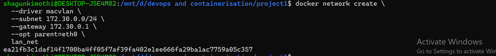
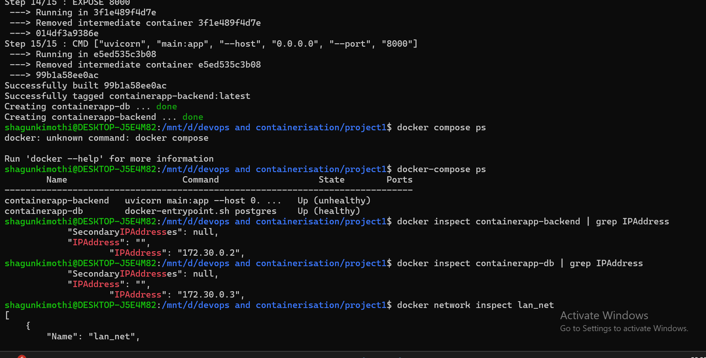
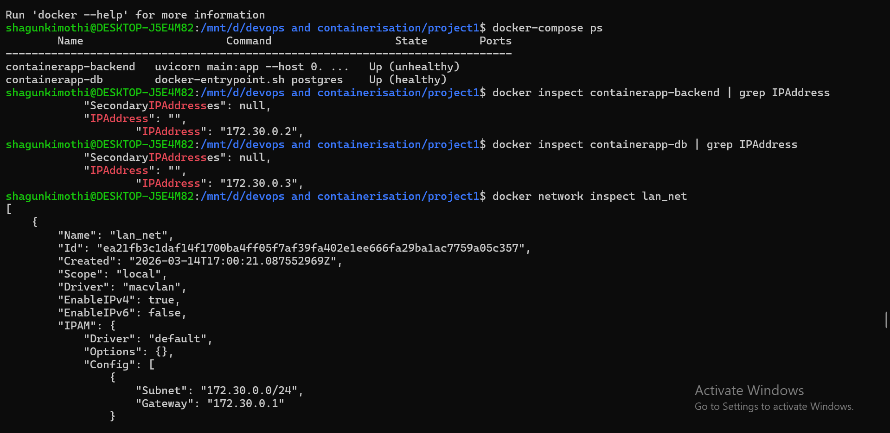
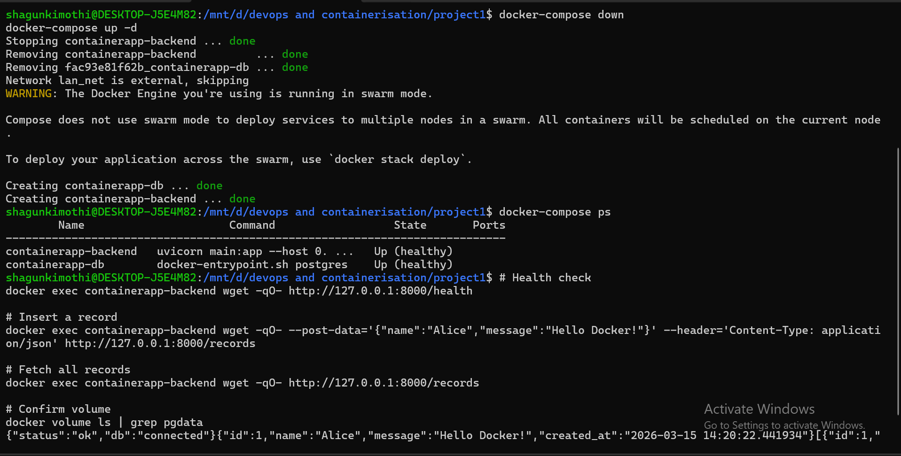

# ContainerApp 🐳

> Containerized Web Application with PostgreSQL using Docker Compose & Macvlan/Ipvlan


---

## 📁 Project Structure
```
project1/
├── backend/
│   ├── Dockerfile          # Multi-stage, python:3.12-alpine, non-root user
│   ├── .dockerignore
│   ├── main.py             # FastAPI application
│   ├── requirements.txt
│   └── static/
│       └── index.html      # Frontend UI
├── database/
│   ├── Dockerfile          # Custom postgres:16-alpine, multi-stage
│   ├── .dockerignore
│   └── init.sql            # Auto table creation on startup
├── docker-compose.yml
├── .env
├── .env.example
└── README.md
```

---

## 🏗 Architecture

| Component | Container Name | IP Address | Port |
|-----------|---------------|------------|------|
| FastAPI Backend | containerapp-backend | 172.30.0.2 | 8000 |
| PostgreSQL Database | containerapp-db | 172.30.0.3 | 5432 |
```
Client (Browser / Postman)
          |
          |  HTTP :8000
          v
 Backend Container [172.30.0.2]   ← static IP via macvlan/eth0
          |
          |  TCP :5432
          v
 Database Container [172.30.0.3]  ← static IP via macvlan/eth0
          |
          v
 Named Volume: containerapp_pgdata  ← persistent storage
```

---

## 🚀 Quick Start

### Prerequisites
- Docker + Docker Compose installed
- WSL2 (Ubuntu) on Windows or bare-metal Linux

### Step 1 — Create the macvlan network
```bash
docker network create \
  --driver macvlan \
  --subnet 172.30.0.0/24 \
  --gateway 172.30.0.1 \
  --opt parent=eth0 \
  lan_net
```

> **On restricted networks (university Wi-Fi / VMs)** use ipvlan instead:
> ```bash
> docker network create \
>   --driver ipvlan \
>   --subnet 172.30.0.0/24 \
>   --gateway 172.30.0.1 \
>   --opt parent=eth0 \
>   --opt ipvlan_mode=l2 \
>   lan_net
> ```

### Step 2 — Set up environment
```bash
cp .env.example .env
```

### Step 3 — Build and start
```bash
docker-compose up --build -d
```

### Step 4 — Verify
```bash
docker-compose ps
```

Expected output:
```
Name                    Command               State        Ports
----------------------------------------------------------------
containerapp-backend    uvicorn main:app ...  Up (healthy)
containerapp-db         docker-entrypoint...  Up (healthy)
```

---

## 🔌 API Endpoints

| Method | Endpoint | Description |
|--------|----------|-------------|
| GET | `/health` | Health check + DB connectivity status |
| GET | `/records` | Fetch all records from database |
| POST | `/records` | Insert a new record |
| GET | `/` | Serves the frontend UI |

### Test Health
```bash
docker exec containerapp-backend wget -qO- http://127.0.0.1:8000/health
# {"status":"ok","db":"connected"}
```

### Insert a Record
```bash
docker exec containerapp-backend wget -qO- \
  --post-data='{"name":"Alice","message":"Hello Docker!"}' \
  --header='Content-Type: application/json' \
  http://127.0.0.1:8000/records
# {"id":1,"name":"Alice","message":"Hello Docker!","created_at":"..."}
```

### Fetch All Records
```bash
docker exec containerapp-backend wget -qO- http://127.0.0.1:8000/records
# [{"id":1,"name":"Alice","message":"Hello Docker!","created_at":"..."}]
```

---

## 📸 Screenshot Proofs

### 1. Macvlan Network Creation


### 2. Macvlan Network ID Returned


### 3. Network Create Command


### 4. Container Build + IPs Confirmed


### 5. Docker Network Inspect


### 6. Health Check + POST + GET + Volume Test


---

## 📦 Docker Image Sizes

| Image | Optimized Size | Base Image |
|-------|---------------|------------|
| containerapp-backend | 111 MB | python:3.12-alpine |
| containerapp-db | 276 MB | postgres:16-alpine |
| **Total** | **387 MB** | — |

> Standard non-alpine equivalent would be ~875 MB — **56% reduction** achieved through multi-stage builds and Alpine base images.

---

## 🐳 Docker Compose Highlights

- ✅ Both services defined in single `docker-compose.yml`
- ✅ External macvlan network `lan_net` with static IPs
- ✅ Named volume `containerapp_pgdata` for data persistence
- ✅ `restart: unless-stopped` policy on both containers
- ✅ Healthchecks on both services
- ✅ `depends_on` with `condition: service_healthy`
- ✅ All credentials via environment variables

---

## 🔒 Security Practices

- Non-root user in both containers (`appuser` / `postgres`)
- Minimal Alpine base images — reduced attack surface
- No hardcoded credentials — all via `.env`
- `.dockerignore` excludes sensitive files from build context

---

## ⚠️ WSL2 Host Isolation Note

With macvlan, the **host machine cannot directly reach containers** by their IP. This is a known macvlan limitation — it bypasses the host network stack.

**Solutions:**
1. Access containers from another device on the same LAN ✅
2. Use ipvlan driver instead (no host isolation) ✅
3. Add a macvlan bridge interface on the host:
```bash
sudo ip link add macvlan0 link eth0 type macvlan mode bridge
sudo ip addr add 172.30.0.1/32 dev macvlan0
sudo ip link set macvlan0 up
sudo ip route add 172.30.0.2/32 dev macvlan0
sudo ip route add 172.30.0.3/32 dev macvlan0
```

---

## 🛠 Useful Commands
```bash
# View live logs
docker-compose logs -f

# Check container status
docker-compose ps

# Inspect network
docker network inspect lan_net

# Check volume
docker volume ls | grep pgdata

# Stop containers
docker-compose down

# Stop and wipe DB data
docker-compose down -v

# Rebuild from scratch
docker-compose up --build -d
```

---

## 👤 Author

**Shagun Kimothi** — Containerization and DevOps, 2026